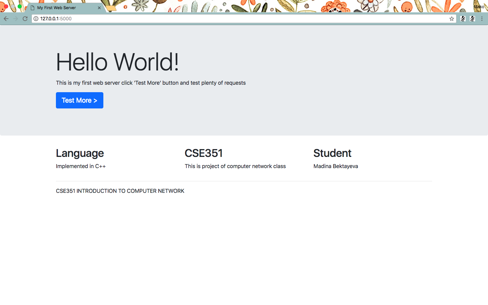
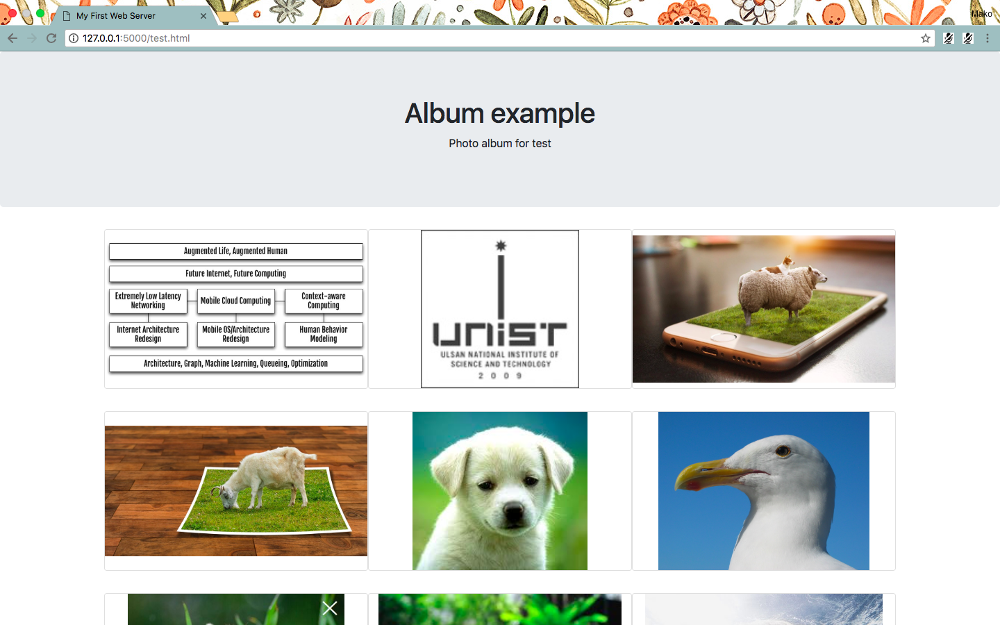

This project is done as part of CSE351 at UNIST. 

The goal of a project was yo implement server on C++ via socket programming which will listen to a client in a Thread Pool manner and then send a webpage to the client.

<h>Result:</h>

<h>Usage:</h>

<b>In terminal</b>

make

./server

<b>In web browser</b>

http://[IP address of your machine]:5000

where [IP address] can be checked via ifconfig
